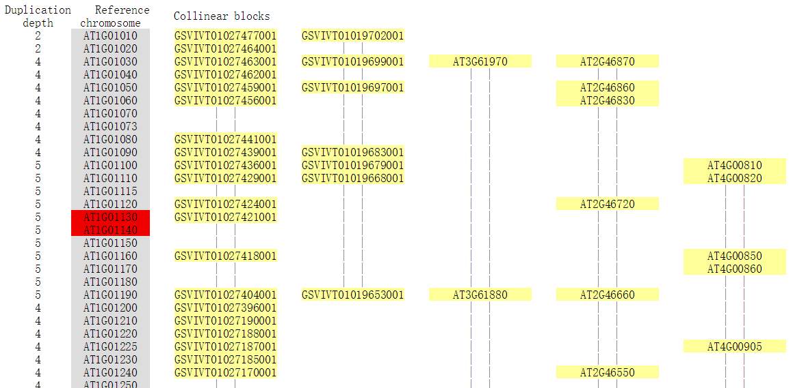
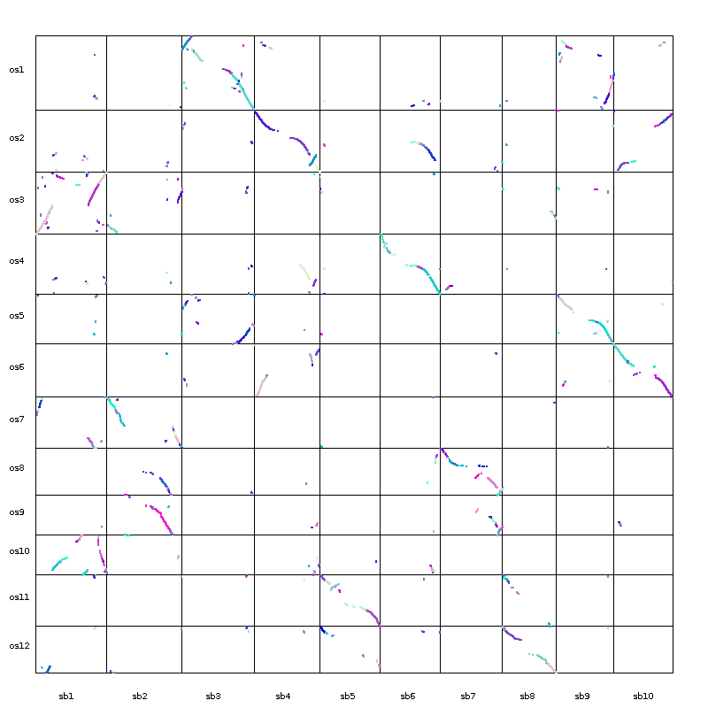
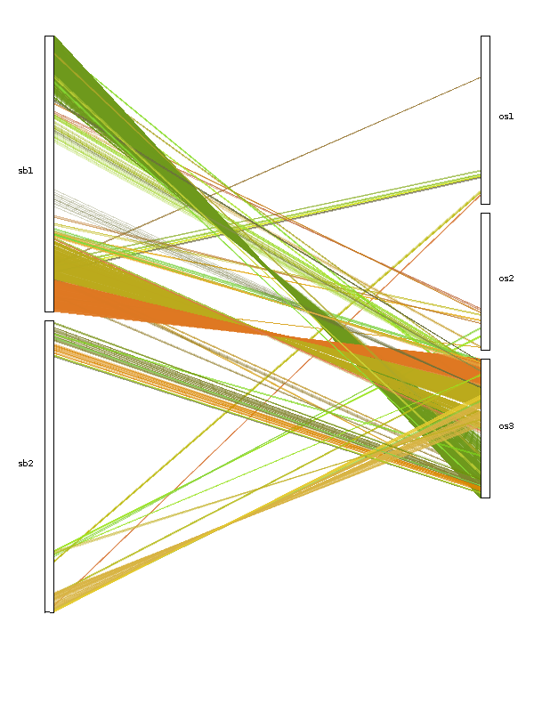
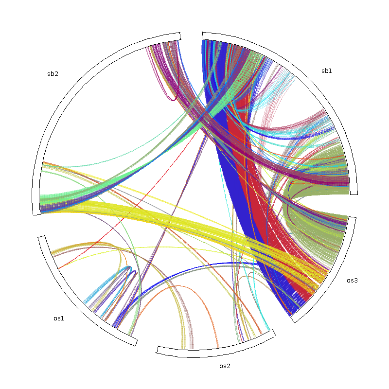
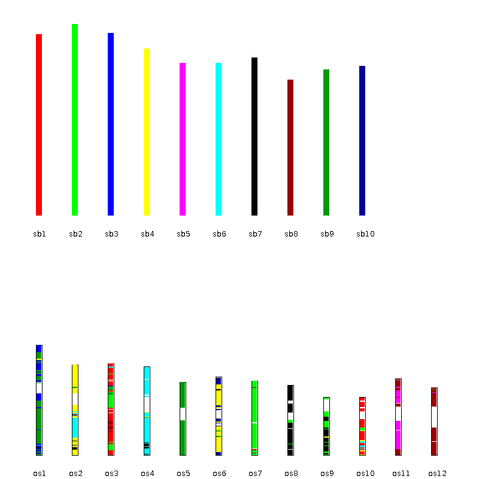

## [MCScanX](http://chibba.pgml.uga.edu/mcscan2/): https://github.com/wyp1125/MCScanX

### [MCScanX manual examples](http://chibba.pgml.uga.edu/mcscan2/examples/)

### install MCScanX
```
$ cd /home/wzk/anaconda3/envs/evolution/bin
$ wget http://chibba.pgml.uga.edu/mcscan2/MCScanX.zip
$ unzip MCScanX.zip && cd MCScanX
$ make
g++ struct.cc mcscan.cc read_data.cc out_utils.cc dagchainer.cc msa.cc permutation.cc -o MCScanX
msa.cc: In function ‘void msa_main(const char*)’:
msa.cc:289:22: error: ‘chdir’ was not declared in this scope
     if (chdir(html_fn)<0)
                      ^
makefile:2: recipe for target 'mcscanx' failed
make: *** [mcscanx] Error 1

```

#### solution

if you are building on 64-bit you may need to add
```
#include <unistd.h>
```
to msa.h, dissect_multiple_alignment.h, and detect_collinear_tandem_arrays.h


```
$ make
g++ struct.cc mcscan.cc read_data.cc out_utils.cc dagchainer.cc msa.cc permutation.cc -o MCScanX
g++ struct.cc mcscan_h.cc read_homology.cc out_homology.cc dagchainer.cc msa.cc permutation.cc -o MCScanX_h
g++ struct.cc dup_classifier.cc read_data.cc out_utils.cc dagchainer.cc cls.cc permutation.cc -o duplicate_gene_classifier
g++ dissect_multiple_alignment.cc -o downstream_analyses/dissect_multiple_alignment
g++ detect_collinear_tandem_arrays.cc -o downstream_analyses/detect_collinear_tandem_arrays
cd downstream_analyses/ && make
make[1]: Entering directory '/home/wzk/software/MCScanX/downstream_analyses'
javac -g dot_plotter.java
javac -g family_tree_plotter.java
javac -g family_tree_plotter_show_length.java
javac -g bar_plotter.java
javac -g dual_synteny_plotter.java
javac -g circle_plotter.java
javac -g family_circle_plotter.java
javac -g family_tree_plotter_chr.java
make[1]: Leaving directory '/home/wzk/software/MCScanX/downstream_analyses'
```


### parameters

```
$ ./MCScanX -h
[Usage] ./MCScanX prefix_fn [options]
 -k  MATCH_SCORE, final score=MATCH_SCORE+NUM_GAPS*GAP_PENALTY
     (default: 50)
 -g  GAP_PENALTY, gap penalty (default: -1)
 -s  MATCH_SIZE, number of genes required to call a collinear block
     (default: 5)
 -e  E_VALUE, alignment significance (default: 1e-05)
 -m  MAX_GAPS, maximum gaps allowed (default: 25)
 -w  OVERLAP_WINDOW, maximum distance (# of genes) to collapse BLAST matches (default: 5)
 -a  only builds the pairwise blocks (.collinearity file)
 -b  patterns of collinear blocks. 0:intra- and inter-species (default); 1:intra-species; 2:inter-species
 -h  print this help page

```


### blastp（protein-protein BLAST）

combine sequences of two species, blast by self when comparing both inter- or intra- genomes
```
$ cat at.fa vv.fa >>all.fasta
```

```
$ makeblastdb -in all.fa-dbtype prot -parse_seqids -out all  (-logfile allpep.log -title all)
```

```
blastp -query all.fa -db all -out at_vv.blast -evalue 1e-10  -num_threads 16 -outfmt 6 -num_alignments 5
```


### run MCScanX

input files:
```
$ head data/test/at_vv.blast 
AT1G50920   AT1G50920   100.00  671 0   0   1   671 1   671 0.0 1316
AT1G50920   AT1G10300   75.33   673 149 3   1   671 30  687 0.0  985
AT1G50920   AT1G80770   27.24   290 204 3   62  349 147 431 2e-27    120
AT1G50920   AT3G23860   35.68   185 102 6   6   179 6   184 9e-18   88.6
AT1G50920   AT1G78010   25.11   219 136 8   171 382 320 517 1e-06   52.0
AT1G36960   AT1G36960   100.00  181 0   0   1   181 1   181 9e-72    265
AT1G36960   AT5G36228   53.52   71  33  0   8   78  108 178 2e-17   84.7
AT1G36960   AT5G25600   60.61   66  25  1   11  76  111 175 8e-17   82.8
AT1G36960   AT1G48095   77.53   89  20  0   89  177 117 205 2e-14   75.5
AT1G36960   AT1G48095   80.65   31  6   0   46  76  18  48  1e-08   55.8


$ head data/test/at_vv.gff 
at3 AT3G19630   6818676 6820674
at5 AT5G11220   3577057 3577854
at2 AT2G29110   12506880    12510552
at3 AT3G19790   6874937 6875440
at3 AT3G60770   22460525    22461656
at3 AT3G21570   7600297 7600707
at5 AT5G07420   2349547 2351366
at4 AT4G12030   7210981 7212713
at2 AT2G15010   6484422 6485001
at4 AT4G26730   13472579    13473309
```


run MCScanX


```
$ ./MCScanX data/test/at_vv
Reading BLAST file and pre-processing
Generating BLAST list
221910 matches imported (202585 discarded)
582 pairwise comparisons
1288 alignments generated
Pairwise collinear blocks written to data/test/at_vv.collinearity [16.172 seconds elapsed]
Tandem pairs written to data/test/at_vv.tandem
Writing multiple syntenic blocks to HTML files
```

**at_vv** is the prefix of two input files


out files:

output two files with suffix of **collinearity** and **tandem**,

and also out a lot of **html** files
```
$ head  data/test/at_vv.collinearity

############### Parameters ###############
# MATCH_SCORE: 50
# MATCH_SIZE: 5
# GAP_PENALTY: -1
# OVERLAP_WINDOW: 5
# E_VALUE: 1e-05
# MAX GAPS: 25
############### Statistics ###############
# Number of collinear genes: 24437, Percentage: 47.49
# Number of all genes: 51452
##########################################
## Alignment 0: score=8972.0 e_value=0 N=190 at1&at1 plus
  0-  0:        AT1G17240       AT1G72300             0
  0-  1:        AT1G17290       AT1G72330             0
  0-  2:        AT1G17310       AT1G72350         5e-41
  0-  3:        AT1G17350       AT1G72420        2e-113
  0-  4:        AT1G17380       AT1G72450         7e-63
  0-  5:        AT1G17400       AT1G72490         2e-82
  0-  6:        AT1G17420       AT1G72520             0
  0-  7:        AT1G17430       AT1G72620        1e-143
  0-  8:        AT1G17455       AT1G72630         1e-53
  0-  9:        AT1G17460       AT1G72650        7e-152
  0- 10:        AT1G17470       AT1G72660             0
  0- 11:        AT1G17480       AT1G72670         3e-93


$ head data/test/at_vv.tandem
AT1G01130,AT1G01140
AT1G01580,AT1G01590
AT1G01660,AT1G01670
AT1G01670,AT1G01680
AT1G02190,AT1G02205
AT1G02220,AT1G02230
AT1G02230,AT1G02250
AT1G02300,AT1G02305
AT1G02430,AT1G02440
AT1G02470,AT1G02475
```

html file:




### down strwam analysis (plotting)

duplicate_gene_classifier XX 
（0：singleton（非重复基因）1：dispersed（不是2，3，4的其它重复）2：proximal（染色体附近的重复，但是不相邻）3：tandem（串联重复）4：WGD/segmental（在共线性区域的共线性基因））


```
$ cut -f 1 os_sb.gff  | sort | uniq |  sort -k 1 |  xargs -n 50
os1 os10 os11 os12 os2 os3 os4 os5 os6 os7 os8 os9 sb1 sb10 sb2 sb3 sb4 sb5 sb6 sb7 sb8 sb9

```


create the control file:
```
$ cat os_sb.control
800
800
sb1, sb2, sb3, sb4, sb5, sb6, sb7, sb8, sb9, sb10
os1, os2, os3, os4, os5, os6, os7, os8, os9, os10, os11, os12
```

```
$ java dot_plotter -g /home/wzk/anaconda3/envs/evolution/bin/MCScanX/data/test/os_sb.gff -s /home/wzk/anaconda3/envs/evolution/bin/MCScanX/data/test/os_sb.collinearity  -c /home/wzk/anaconda3/envs/evolution/bin/MCScanX/data/test/os_sb.control -o /home/wzk/anaconda3/envs/evolution/bin/MCScanX/data/test/os_sb.dot.png
Exception in thread "main" java.lang.NullPointerException
    at dot_plotter.paint(dot_plotter.java:163)
    at dot_plotter.main(dot_plotter.java:262)
```

####  solution
Make sure that the **chromosome IDs** are separated by commas with **no spaces**. Besides, the separator between chromosome IDs and annotation //chromosomes.... must be **TAB**, not SPACE, or you can simply remove the annotation.

```
$ cat /home/wzk/anaconda3/envs/evolution/bin/MCScanX/data/test/os_sb.control
800
800
sb1,sb2,sb3,sb4,sb5,sb6,sb7,sb8,sb9,sb10
os1,os2,os3,os4,os5,os6,os7,os8,os9,os10,os11,os12

```


#### dot plotting
```
$ java dot_plotter -g /home/wzk/anaconda3/envs/evolution/bin/MCScanX/data/test/os_sb.gff -s /home/wzk/anaconda3/envs/evolution/bin/MCScanX/data/test/os_sb.collinearity  -c /home/wzk/anaconda3/envs/evolution/bin/MCScanX/data/test/os_sb.control -o /home/wzk/anaconda3/envs/evolution/bin/MCScanX/data/test/os_sb.dot.png

```




#### dual_synteny plotting
```
$ java dual_synteny_plotter  -g /home/wzk/anaconda3/envs/evolution/bin/MCScanX/data/test/os_sb.gff -s /home/wzk/anaconda3/envs/evolution/bin/MCScanX/data/test/os_sb.collinearity  -c /home/wzk/anaconda3/envs/evolution/bin/MCScanX/data/test/dual_synteny.ctl  -o /home/wzk/anaconda3/envs/evolution/bin/MCScanX/data/test/os_sb.dual.synteny.png
```




#### circle plotting
```
$ java circle_plotter  -g /home/wzk/anaconda3/envs/evolution/bin/MCScanX/data/test/os_sb.gff -s /home/wzk/anaconda3/envs/evolution/bin/MCScanX/data/test/os_sb.collinearity  -c /home/wzk/anaconda3/envs/evolution/bin/MCScanX/data/test/circle.ctl  -o /home/wzk/anaconda3/envs/evolution/bin/MCScanX/data/test/os_sb.circle.png
```



#### bar plotting
```
$ java  bar_plotter  -g /home/wzk/anaconda3/envs/evolution/bin/MCScanX/data/test/os_sb.gff -s /home/wzk/anaconda3/envs/evolution/bin/MCScanX/data/test/os_sb.collinearity  -c /home/wzk/anaconda3/envs/evolution/bin/MCScanX/data/test/os_sb.control  -o /home/wzk/anaconda3/envs/evolution/bin/MCScanX/data/test/os_sb.bar_plot.png
```


