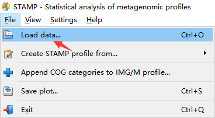
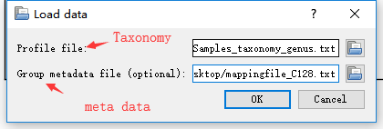
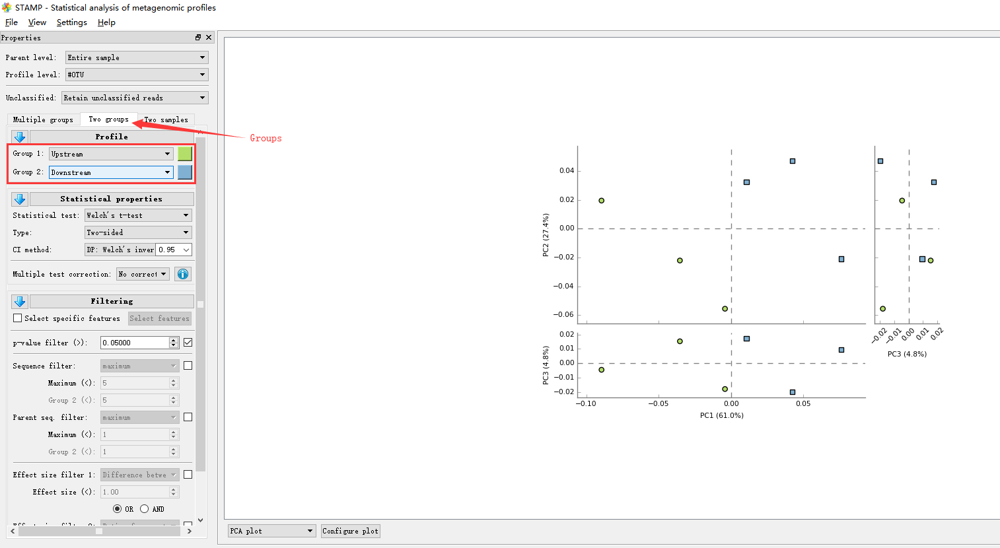
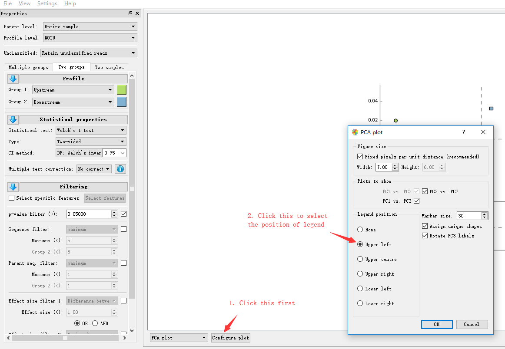
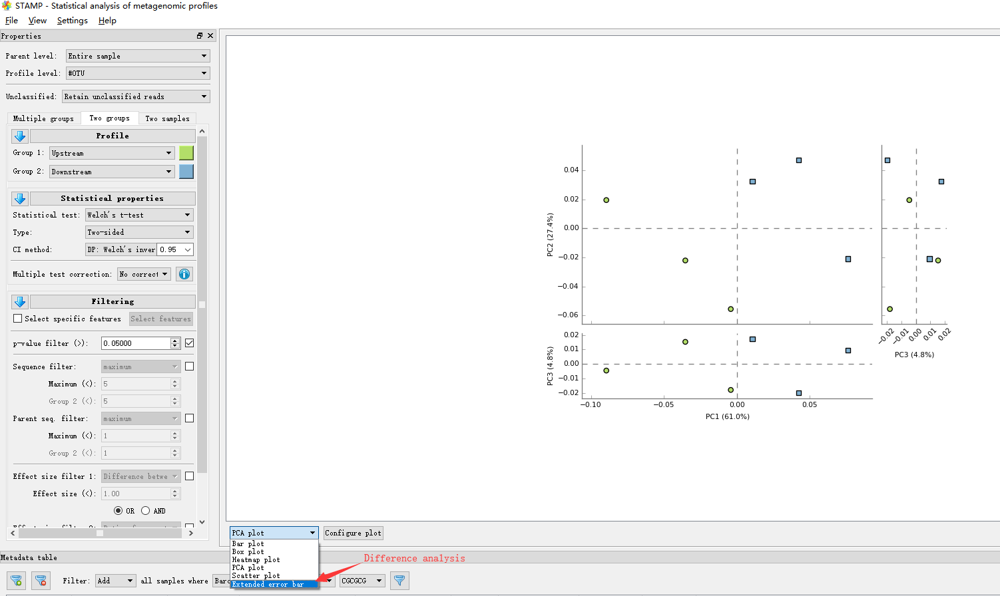
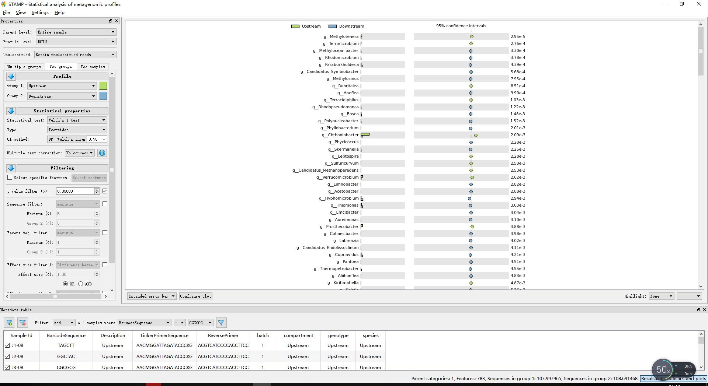
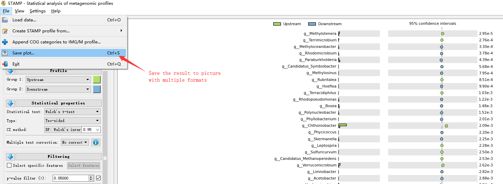

## STAMP manual

### [STAMP software](http://kiwi.cs.dal.ca/Software/STAMP)

### interface manual for STAMP

* 载入数据

* 数据包括两个，一个文件含有OUT及其在样品中的丰度值（taxonomy）；另一个文件含有样品的分类信息（meta data）

* 选择group这一分析大类，再选择比较的分组

* 点击Configure plot，在Legend position中勾选Upper Left选择legend位置为结果左上角

* 分析内容，选择最下方的extended-error bar

* 分析结果如图

* 结果保存为pdf文件（或者svg, png）

