# Trim adapters completely

### Adapters
```
$ cat miRNA.fa 
>miRNA-F
AATGATACGGCGACCACCGAGATCTACACGTTCAGAGTTCTACAGTCCGACGATC
>miRNA-F-as
GATCGTCGGACTGTAGAACTCTGAACGTGTAGATCTCGGTGGTCGCCGTATCATT
>miRNA-R
TGGAATTCTCGGGTGCCAAGGAACTCCAGTCAC
>miRNA-R-as
GTGACTGGAGTTCCTTGGCACCCGAGAATTCCA
>miRNA-PCR-R
CAAGCAGAAGACGGCATACGAGAT
>miRNA-PCR-R-as
ATCTCGTATGCCGTCTTCTGCTTG

```

### R1 reads

R1 reads contain **miRNA-R** , index (TATTCGCG) and **miRNA-PCR-R-as** sequences

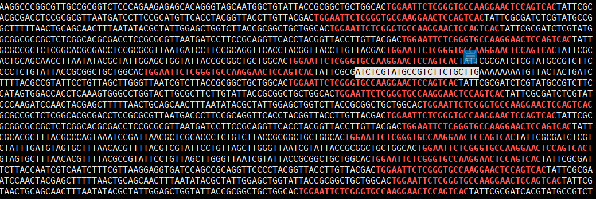

### Test data

test data with different length of adapters

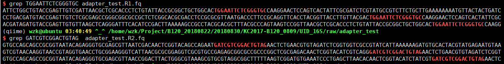

### Trim adapters using SOAPnuke

```
$ /home/zyb/soft/SOAPnuke filter -1 adapter_test.R1.fq -2 adapter_test.R2.fq -f TGGAATTCTCGGGTGCCAAGGAACTCCAGTCAC -r GATCGTCGGACTGTAGAACTCTGAACGTGTAGATCTC --cutAdaptor 30 -o cut -C adapter_filt.R1.fq -D adapter_filt.R2.fq -5 1 -Q 2 -G --misMatch 6 --matchRatio 0.4 
```

output files:

```
$ cat adapter_filt.R1.fq
@E00599:106:HNVVFCCXY:1:1102:11292:46824 1:N:0:TATTCGCG
ATTCTGGCTGTACCGAGTTGTCGATTAACGCTCGCACCCTCTGTATTACCGCGGCTGCTGGCAC
+
AAAFFJJJFJJJJJJJJJJJJJJJJFJJJJFJFJJFAJ<J<JJJJJJJJJFFFFJJJJJJJJJJ
@E00599:106:HNVVFCCXY:1:1102:22729:47017 1:N:0:TATTCGCG
CCTGACGATGTACCGAGTTGTCTCGCGAGCCGGGCGGCGCCGCTCTCGGCACGCGACCTCCGCGCGTTAATGACCCTTCCGCAGGTTCACCTACGGTTACCTTGTTACGAC
+
AAFFFJA-7AAJA-<AFAF<A<-7FFA-AJ<<AFJJF<7A7FFA--A<F7JJFJJ-A<7F77AFFA-A-7A7FJ7A<<<FJAJ-7AA<<F7-FA--F-FAAJFJFAJF--7
@E00599:106:HNVVFCCXY:1:1102:15696:24638 1:N:0:TATTCGCG
ACGATAGATGTACCGAGTTGTGTTAAGCTCAGGGATTTCACATCCGACTTAAAAAGCCGCCTACGCACGCTTTACGCCCAGTAAGTCCGGTTAACGCTCGCACCCTCTGTATTACCGCGGCTGCTGGCAC
+
AAFFFJJJJJJJJJJJJJJJJJJJJJJJJJJJJJJJJJJJJJJJJJJJJJJJJJJJJJJJJJJJJJJJJJJJJJJJJJJJJJJJJJJJJJJJJJJJJJJJJJJJJJJJJJJJJJJJJJJJJJJJJJJJJJ
```


#### SOAPnuke can not trim short adapter

SOAPnuke trim the adapters based on the parameters **misMatch** and **matchRatio**

* with larger **matchRatio** value, short adapter can not bed trimmed
* with lower **matchRatio** value, valid sequence same to partial adapter may be cut off

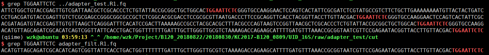


#### fastp can not trim long adapter

```
$ fastp --in1 adapter_test.R1.fq --in2 adapter_test.R2.fq  --out1 adapter_fastp_trim.R1.fq --out2 adapter_fastp_trim.R2.fq
```


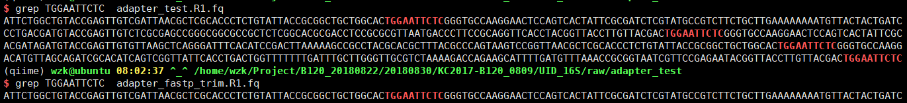


### Trim adapter combining SOAPnuke and fastp

raw reads:

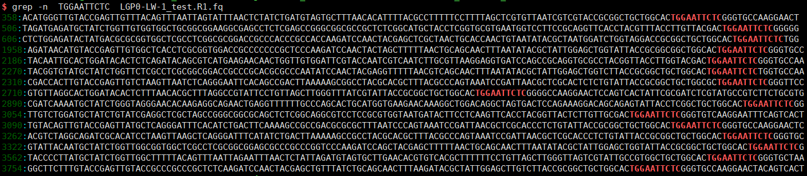

#### Trim adapters using **fastp** and then **SOAPnuke**

fastp result:

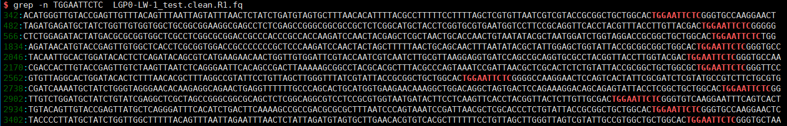

SOAPnuke result:

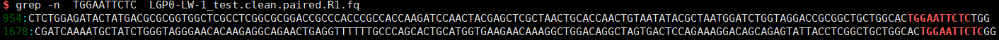

#### Trim adapters using **SOAPnuke** and then  **fastp**

SOAPnuke result:

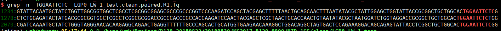

fastp result:

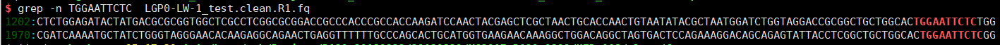


## Compare of three softwares

The raw data:

R1:
```
$ cat trim_test.R1.fq
@E00603:169:HNK23CCXY:5:1101:2432:25780 1:N:0:CGAGGCTG
GTCTTGTCTGTACCGAGTTGTGATGCAGTTTTGAAAGCAGTTCCGGGGTTGAGCCCCGGGATTTCACTCCCAACTTGCATCTCCGCCTACACGCCCTTTACACCCAGTAAATCCGGACAACGCTTGCAACCTACGTATTACCGCGGCTGC
+
AAFFFJJJFJJJJJJJJJJJFJJJJJJJFFFJJJJJJJJJJFJJJFFJJFJJJJJJJJJJJJJJJJFJJJJJJJJJJJJJJJJJJJJJJJJJJFJJJJFJJJJJJJJJJJJJJJJJJJJJJJJFJJJJJJJJJJFFFJJJJJ<JAJJFJJ
@E00603:169:HNK23CCXY:5:1101:22282:25745 1:N:0:CGAGGCTG
TCAAGCGATGTACCGAGTTGGGGTTGAGCCGGGAACTTTCACCGCTGTCTTAACATTCCGCCTACGCACCCTTTAAACCCAATAAATCCGGATAACGCTCGCATCCTCCGTCTTACCGCGGCTGCTGGCACTGGAATTCTCGGGTGCCAA
+
AAFFFJJ-AFJJJJAAA-7FJJAAFFJJJJJ7JJJJFJJFJJJJJJJJJJJJJJJFJJJJJF-FJJJJJJJJJJAFJJJJJJ<JJJFFAA<JAFJ<FJ-F<J<AJFFJJJJJFAJFFFFFAJ7FF--FFJFAFJFAJ-AAAJ<JJJJJJA
@E00603:169:HNK23CCXY:5:1101:1458:25605 1:N:0:CGAGGCTG
TCTTCCTGGCAGATCGCACATTCACATCTAACTTACCGTCCCGCCTACGCTCCCTTTACACCCAGTAATTCCGGACAACGCTTGCTCCCTACGTCTTACCGCGGCTGCTGGCACTGGAATTCTCGGGTGCCAAGGAACTCCAGTCACCGA
+
AAA<FJJJ<FAJJFJJJFFFJJJFFJJJJJJJJJJJJJFJJJJJJFJJJJJJJJJJJJJJJJJJFJJ<JJAJJJJJFAFFFFF<<7FFJ<FJJJJJJJJJ<J7JJ7JJJJAFFJFJAJJJJJJJJ<AAAFJ<FFF-<AFJFA)-FFJJJA
@E00603:169:HNK23CCXY:5:1101:28828:25165 1:N:0:CGAGGCTG
GACCCCATTGTACCGAGTTGTCCGCCTACGCACCCTTTAAACCCAATAAATCCGGATAACGCTCGCATCCTCCGTCTTACCGCGGCTGCTGGCACTGGAATTCTCGGGTGCCAAGGAACTCCAGTCACCGAGGCTGATCTCGTATGCCGT
+
AAFFFJJJJJJJJJFJJJJJJJJJJJJJFJJJJJJJJJJJJJJJJJJJJJJJJJJJJJJJJJJJJJJJJJJJJJJJJJJJJJJJJJJJJJAJJJJJJJJJJJJJJFJJJJJJJJJJJJJJJJJJJJJJJJJJJJJJJFJ<7FJJAJJJJF
@E00603:169:HNK23CCXY:5:1101:4503:24972 1:N:0:CGAGGCTG
TGGCAGTTGCAGATCGCACATATGATTCCGGACAACGCTTGCACCCCCCGTATTACCGCGGCTGCTGGCACTGGAATTCTCGGGTGCCAAGGAACTCAAGTCACCGAGGCTGATCTCGTATGCCGTCTTCTGCTTGAAAAAATATAGGGG
+
AAFFFJJJJJJJJJJJJJJJ<FJJJJJJJJAJJJJJJJFJJJJJJJJJJJJJJJJJJJJJJJJJJJJJJJJJJJJJJJJJJJJJJJJJJJJJJJJJJJJJJJJJJJJJJJJJJJJ-AFJJJJFJJ<JFJJFFFJJ<AFF<FJ-7----7)
```

R2:
```
$ cat trim_test.R2.fq
@E00603:169:HNK23CCXY:5:1101:2432:25780 2:N:0:CGAGGCTG
GTGCCAGCAGCCGCGGTAATACGTAGGTTGCAAGCGTTGTCCGGATTTACTGGGTGTAAAGGGCGTGTAGGCGGAGATGCAAGTTGGGAGTGAAATCCCGGGGCTCAACCCCGGAACTGCTTTCAAAACTGCATCACAACTCGGTACAGA
+
AAFFFJJJJJJJJJJJJJJJJJJJJJJJJJJJJJJJJJJFJJJJJJJJJJJJJJJJJJJJFFJJJJJJJJJJJJJFJJJJFFJJJJJJJJJJJJFJJJJJJJJJAFJJJJJJJJAJ<AFJJJJJJJFJJJJJJAAFJJJJFJJJJJJJJJ
@E00603:169:HNK23CCXY:5:1101:22282:25745 2:N:0:CGAGGCTG
GTGCCAGCAGCCGCGGTAAGACGGAGGATGCGAGCGTTATCCGGATTGATTGGGTGTAAAGGGTGCGTAGGCGGAATGTTAAGACAGCGGTGAAAGTTCCCGGCTCAACCACAACTCGGTACATCGCTTGAGATCGTCGGACTGTAGAAC
+
AAAFFJJFJJJJJJJJAJJ7FFJJFJJ<-FJJJFJJ<FAJFJFJ---<<-AFJJJ-7AAJAJAAJJJ-7JFFJJJ77AAJFJJJJAFJJJFJ-FJJ-FAAJFJJA<JJJJJJ<JJAAFJJAAF<FJJJJJJ<<AAJ7<7<7A<AFJJJJJ
@E00603:169:HNK23CCXY:5:1101:1458:25605 2:N:0:CGAGGCTG
GTGCCAGCAGCCGCGGTAAGACGTAGGGAGCAAGCGTTGTCCGGAATTACTGGGTGTAAAGGGAGCGTAGGCGGGACGGTAAGTTAGATGTGAATGTGCGATCTGCCAGGAAGAGATCGTCGGACTGTAGAACTCTGAACGTGTAGATCT
+
AAFFFJJJJJJJJJJJJJJFJJJJJJJJJJJJJJJJJJFJJJJJJJJJJJJJJJJJJJJJJJJFJJJJJJJJJJFAFJJAFFJFJFJAJJJJJFJJJJJJFFJJJJJJJJFJJJJJJJJJJJJAJAFFJJJJJJJFFAJFJJJJJF7AFJ
@E00603:169:HNK23CCXY:5:1101:28828:25165 2:N:0:CGAGGCTG
GTGCCAGCAGCCGCGGTAAGACGGAGGATGCGAGCGTTATCCGGATTTATTGGGTTTAAAGGGTGCGTAGGCGGACAACTCGGTACAATGGGGTCGATCGTCGGACTGTAGAACTCTGAACGTGTAGATCTCGGTGGTCGCCGTATCATT
+
AAFFFJJJJJJJJJJJJJJJJJJJJJJJJJJJJJJJJJJJJJJJJJJJJJJJJJJJJJJJJJJJJJJJJJJJJJJFJJJJJJJJJJJJJJJJJJJJJJJJJJJJJJJJJJJJJJJJJJJJJJJJJJJJJJJJJJJJJJJJJJJJJJJJJJ
@E00603:169:HNK23CCXY:5:1101:4503:24972 2:N:0:CGAGGCTG
GTGCCAGCAGCCGCGGTAATACGGGGGGTGCAAGCGTTGTCCGGAATCATATGTGCGATCTGCAACTGCCAGATCGTCGGACTGTAGAACTCTGAACGTGTAGATCTCGGTGGTCGCCGTATCATTAAAAAATTAATGTTGGGAGGGGTG
+
AAFFFJJJJJJJJJJJJJJJJJJJJJAFFJJJJJJJJJAJJJJJJJJJJJJJFJJJJJJJJJJFFJJJJJJJJJJFJJJJJJJJJJJJJJJJFJJAJJJJJJJFJJJJJJJJFFFAJJFFJJJAFJFJJJJJ-7----7---)7)))))-

```

### adapters

R1: TTACCGCGGCTGCTGGCACTGGAATTCTCGGGTGCCAAGGAACTCCAGTCAC 

R2: GATCGTCGGACTGTAGAACTCTGAACGTGTAGATCTCGGTGGTCGCCGTATCATT

```
$ grep TTACCGCGGCTGC trim_test.R1.fq
```

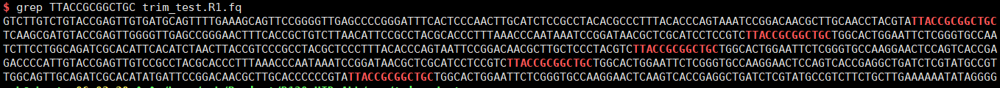


```
$ grep GATCGTCGGACTGTA trim_test.R2.fq
```

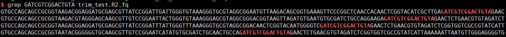

One read in R2 may have mismatch in adapter


### Trim adapters

Trim adapters using **fastp**
```
fastp --in1 trim_test.R1.fq --in2 trim_test.R2.fq --out1 trim_test_fastp.R1.fq --out2 trim_test_fastp.R2.fq

## or

fastp --in1 trim_test.R1.fq --in2 trim_test.R2.fq --out1 trim_test_fastp-1.R1.fq --out2 trim_test_fastp-1.R2.fq --adapter_sequence TTACCGCGGCTGCTGGCACTGGAATTCTCGGGTGCCAAGGAACTCCAGTCAC
```

Trim adapters using **cutadapt**
```
cutadapt -a TTACCGCGGCTGCTGGCACTGGAATTCTCGGGTGCCAAGGAACTCCAGTCAC -A GATCGTCGGACTGTAGAACTCTGAACGTGTAGATCTCGGTGGTCGCCGTATCATT -o trim_test_cutadapt.R1.fq -p trim_test_cutadapt.R2.fq --error-rate 0.2 trim_test.R1.fq trim_test.R2.fq
```


Trim adapters using **SOAPnuke**
```
$ /home/zyb/soft/SOAPnuke filter -1 trim_test.R1.fq -2 trim_test.R2.fq -f TTACCGCGGCTGCTGGCACTGGAATTCTCGGGTGCCAAGGAACTCCAGTCAC  -r GATCGTCGGACTGTAGAACTCTGAACGTGTAGATCTCGGTGGTCGCCGTATCATT --cutAdaptor 30 -o /home/wzk/Project/B120_UID_ALL/raw/trim_adapter -C  trim_test_SOAPnuke.R1.fq -D trim_test_SOAPnuke.R2.fq -5 1 -Q 2 -G --misMatch 6 --matchRatio 0.4
```


### Compare of adapters

The result of trimming R1 adapter

**SOAPnuke** result:

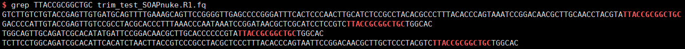


**fastp** result:

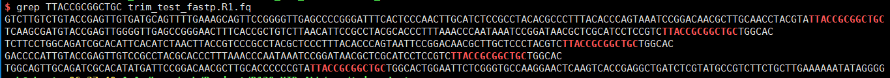

**SOAPnuke** and **fastp** can not completely trim the adapters of R1

**cutadapt** can completely trim the adapters of R1, but the length of R1 and R2 is not identical.

**cutadapt** result:

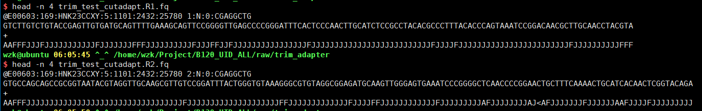


Compare of three softwares:

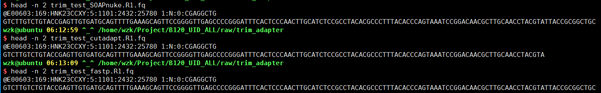